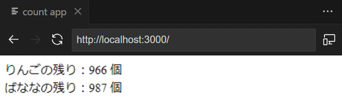

# 概要
りんご・ばななの在庫個数をリアルタイムに表示する Web アプリケーションです。りんごは 1 秒ごと、ばななは 2 秒ごとに在庫個数が減少していきます。

ある時刻でのりんご・ばななの在庫個数


一定時間時間経過後のりんご・ばななの在庫個数


# アーキテクチャ
React, Express, Flask, dapr で構成されるマイクロサービスアーキテクチャとなっており、Azure Container Apps でホスティングされています。

ローカル


Azure


# 準備事項
こちらのサンプルアプリを動かすには、事前準備として dapr のインストールが必要です。dapr は、Linux と Windows でそれぞれインストール方法が異なります。

Linux の場合
```
wget -q https://raw.githubusercontent.com/dapr/cli/master/install/install.sh -O - | /bin/bash
```
Windows の場合
```
powershell -Command "iwr -useb https://raw.githubusercontent.com/dapr/cli/master/install/install.ps1 | iex"
```
https://docs.dapr.io/getting-started/install-dapr-cli/

# ローカル実行
## web (frontend)
### React アプリ起動
```
cd webfrontend
npm start
```
### React アプリの死活確認 (curl で GET リクエスト)
```
curl http://localhost:3000
```

## web (backend)
### Express サーバーと dapr を起動
```
cd webbackend
dapr run --app-port 5000 --app-id webbackend --app-protocol http --dapr-http-port 3079 -- node server.js
```
### Express サーバーの死活確認 (curl で POST リクエスト)
```
curl -X POST -H "Content-Type: application/json" -d '{"apple":300, "banana":200}' http://localhost:5000/test
```

## service
### Flask サーバーと dapr を起動
```
cd service
dapr run --app-port 8080 --app-id service --app-protocol http --dapr-http-port 3080 -- python app.py
```
### Flask サーバーの死活確認 (curl で POST リクエスト)
```
curl -X POST -H "Content-Type: application/json" -d '{"apple":300, "banana":200}' http://localhost:8080/orders 
```

## worker1
### Python プロセスと dapr を起動
```
cd workder1
dapr run --app-id worker1 --app-protocol grpc --dapr-grpc-port 3081 -- python app.py
```

## worker2
### Flask サーバーと dapr を起動
```
cd workder2
dapr run --app-id worker2 --app-protocol grpc --dapr-grpc-port 3082 -- python app.py
```

# デプロイ
以下のコマンドは全て PowerShell で実行しています。

環境変数の設定
```
$RG_NAME="aca-microservices-architecture-rg"
$ENV_NAME="aca-microservices-architecure-env"
$ACR_NAME="acr20231231"
$tag="v1.0.0"
```
Azure ログイン
```
az login
```
リソースグループの作成
```
az group create -n $RG_NAME -l japaneast
```
Azure Container Apps Environments の作成
```
az containerapp env create -n $ENV_NAME -g $RG_NAME -l japaneast
```
コンテナレジストリの作成
```
az acr create -g $RG_NAME -n $ACR_NAME -l japaneast --sku Basic --admin-enabled true
```
コンテナレジストリにログイン
```
az acr login --name $ACR_NAME
```
Webfrontend を build する前に、CountApp.js の以下の部分を書き換えてください。
```
const socket = io('http://localhost:5000');
→ const socket = io('<Webbackend の URL>');
```
コンテナのビルド (xxxx には webfrontend, webbackend, service, worker1, worker2 が入る)
```
cd xxxx
docker build -t "${ACR_NAME}.azurecr.io/xxxx:${tag}" .
```
コンテナイメージのプッシュ (xxxx には webfrontend, webbackend, service, worker1, worker2 が入る)
```
docker push "${ACR_NAME}.azurecr.io/xxxx:${tag}"
```
コンテナアプリケーションのデプロイ (xxxx が webfrontend の場合)
```
az containerapp create -n xxxx -g $RG_NAME --environment $ENV_NAME --registry-server "${ACR_NAME}.azurecr.io" --image "${ACR_NAME}.azurecr.io/xxxx:${tag}" --target-port yyyy --ingress 'external' --min-replicas 1 --max-replicas 1 --memory 4.0Gi --cpu 2.0
```
コンテナアプリケーションのデプロイ (xxxx が webbackend, service の場合)
```
az containerapp create -n xxxx -g $RG_NAME --environment $ENV_NAME --registry-server "${ACR_NAME}.azurecr.io" --image "${ACR_NAME}.azurecr.io/xxxx:${tag}" --target-port yyyy --ingress 'external' --dapr-app-id xxxx --enable-dapr true --min-replicas 1 --max-replicas 1 --memory 4.0Gi --cpu 2.0
```
コンテナアプリケーションのデプロイ (xxxx が worker1, worker2 の場合)
```
az containerapp create -n xxxx -g $RG_NAME --environment $ENV_NAME --registry-server "${ACR_NAME}.azurecr.io" --image "${ACR_NAME}.azurecr.io/xxxx:${tag}" --dapr-app-id xxxx --dapr-app-protocol grpc --enable-dapr true --min-replicas 1 --max-replicas 1 --memory 4.0Gi --cpu 2.0
```

# 留意事項
- React アプリは以下のコマンドを実行して作成されたテンプレートをもとに作成しました。
```
npx create-react-app <React アプリ名>
```
https://ja.legacy.reactjs.org/docs/create-a-new-react-app.html
- Service の Dockerfileは以下の dapr の公式ドキュメントを参考にして作成しました。
https://docs.dapr.io/operations/hosting/self-hosted/self-hosted-with-docker/

# トラブルシューティング
- dapr run の際に redis 関連のエラーが出る → dapr uninstall -all を実行した後、 dapr init を実行して redis を入れなおすと解決。